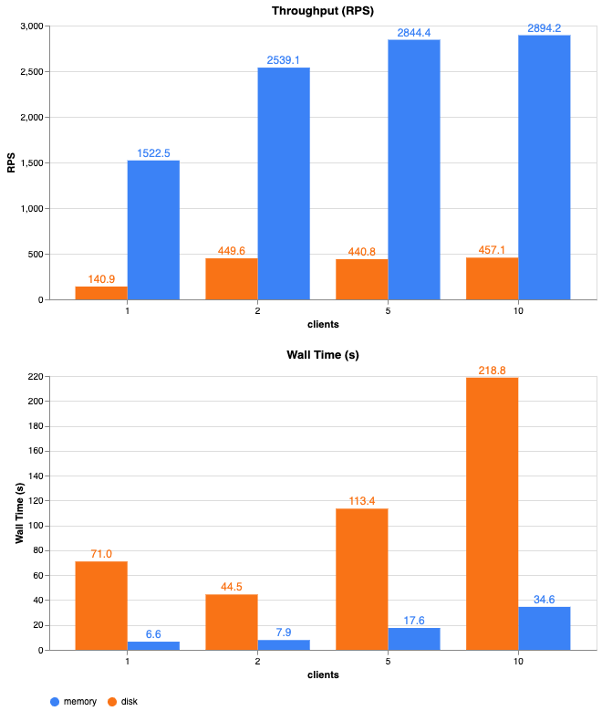

# Web counter

Comparison of throughput using in-memory and disk storage.  
  
## Set up
To do a load test:
1) start `server/server.py` or `server/server-disk.py`
2) run code in `load-test.ipynb`
  
`server/server-disk.py` saves data to counter.txt on local disk.

## Results

## Misc
to run /inc:
`curl http://localhost:8080/inc`

to run /inc in parallel:
`seq 100 | parallel -j 10 curl -s http://localhost:8080/inc`

to run /count:
`curl http://localhost:8080/count`

to run /reset:
`curl http://localhost:8080/reset`
